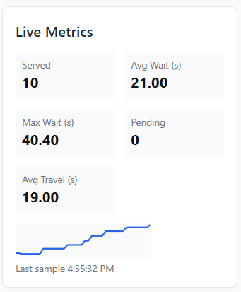
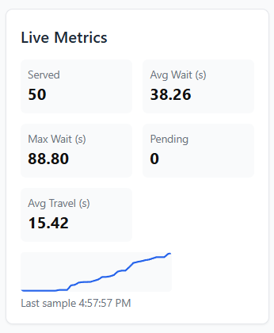
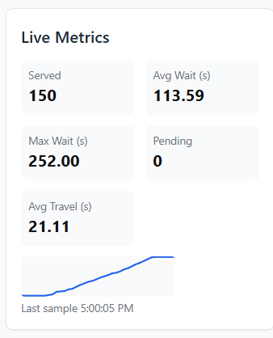

# 🚇 Elevator Simulation (Web-based)

A web-based elevator simulation system that models real-world elevator scheduling, passenger flow, and live performance metrics.  
Built with **React**, **TailwindCSS**, **Node.js (WebSocket)**, and a custom scheduling algorithm.

---

## ✨ Features

- 🔄 **Real-time Simulation** — elevators move floor-by-floor with door open/close events.  
- 📊 **Live Metrics Panel** — average wait, max wait, average travel, throughput, utilization.  
- 🏢 **Building View UI** — interactive floor call buttons and elevator cards with passenger counts.  
- 🎯 **Manual & Scenario Testing** — spawn **Manual Requests**, **Morning Rush**, or **Random Burst**.  
- ⚡ **Configurable Parameters** — change number of elevators, floors, and simulation speed.  
- 🚪 **Capacity Awareness** — elevators respect passenger capacity with *near full* and *full* states.  

---

## 🧠 Algorithm Design & Trade-offs

- **Hybrid Scheduling (SCAN-like + Nearest Car)**  
  - Idle elevators: matched globally with pending requests using scoring (ETA, direction, occupancy).  
  - Busy elevators: opportunistic batching — pickups en route in same direction.  

- **Fairness & Escalation**  
  - Requests waiting > 30s are *escalated* with high priority.  
  - Elevators with high utilization are slightly penalized to balance load.  

- **Trade-offs**  
  - Optimized for lower *average wait* in typical scenarios, at the cost of slightly higher *max wait* under stress.  
  - Simple greedy matching avoids expensive global optimization, making it scalable.

---

## 🎛 User Experience Biases

- **Morning Rush Bias**  
  - During rush hours, all the requests originate from the lobby going upward.  

- **Capacity Indicators**  
  - Elevators visually show passenger count, *near full*, and *full* badges.  

- **Simulation Awareness**  
  - Status bar shows when simulation is *active* or *inactive*.  

---

## 📊 Performance Metrics

We tested the simulation with 12 floors and 3 lifts under three scenarios:

### 1️⃣ Light Random Traffic  
- 10 served requests.  
- **Avg Wait:** 21s  
- **Max Wait:** 40s  
- **Avg Travel:** 19s  

---

### 2️⃣ Morning Rush (Lobby-heavy)  
- 50 served requests.  
- **Avg Wait:** 38s  
- **Max Wait:** 88s  
- **Avg Travel:** 15s  

---

### 3️⃣ Stress Test (Heavy Burst)  
- 150 served requests.  
- **Avg Wait:** 113s  
- **Max Wait:** 252s  
- **Avg Travel:** 21s  

